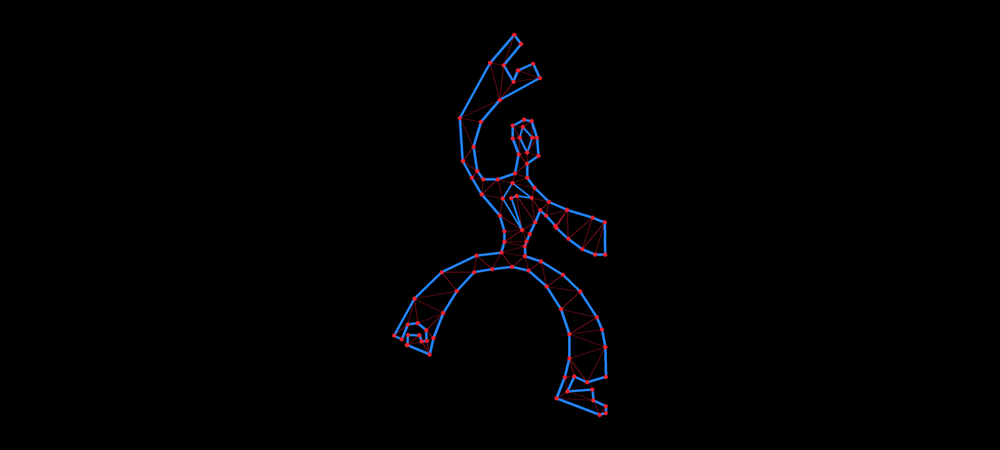

# p2t




[Fixture screenshots](tests/fixtures) show champion-path triangulation meshes for
the root fixtures.

`p2t` is a constrained Delaunay tessellation library for Nim.

Start here: [Public API guide](docs/public-api.md).

Algorithm guides: [Žalik sweep-line CDT](docs/zalik-sweep.md) and
[FlipScan constrained-edge insertion](docs/flipscan.md).

Nim is the superior code warrior's weapon of choice, but for those who wish to
suffer we provide a C ABI on the backend.

## About

I wrote the original Poly2Tri in fits and starts from 2008 to 2009. It began as
a small project on Google Code, which soon drew the attention of Thomas Åhlén.
Thomas contributed the FlipScan constrained-edge insertion idea, the part of the
algorithm that made the advancing-front sweep useful for real constrained
polygons. I ported the library to a few languages, lost interest, and moved on.

In 2026 I found myself back in hobby coding and back on GitHub. I was surprised
to see how many Poly2Tri descendants were still around. The one that caught my
attention was `fast-poly2tri`, because it is exactly what its name says: fast,
hard-optimized C, with arena pointers and tuned sorting.

These days Nim is my favorite language, so I wanted to see how far a Nim version
could be pushed on a single CPU thread. This repository is the result: the
Poly2Tri sweep-line CDT, rebuilt around a pointer arena, pdqsort, a large-input
front hash, and release-codegen tuning.

This level of optimization would have been hard for me to do alone now. I used
AI assistance for code reading, instrumentation, benchmark bookkeeping, and
working through the data. The code and the final engineering decisions remain my
responsibility.

## Final Head-to-Head

The final comparison uses the public `import p2t` API against vendored
`fast-poly2tri` and libtess2, with Shewchuk's Triangle available as an optional
external backend. Times are best/median microseconds per triangulation, from
five sequential `nimble benchCompareAll` passes. Each cell uses the pass with
the lowest best time for that fixture/engine.

Benchmark machine:

- Mac mini (`Mac16,11`)
- Apple M4 Pro, 12 cores (8 performance, 4 efficiency)
- 24 GB memory
- macOS 26.5 (`25F71`), arm64
- Nim 2.2.10

Comparison dependencies are vendored in this repository:

- `fast-poly2tri` commit `c04c633f6e48fb4e79bd511f2c0bb46279fd5773`
- `libtess2` commit `8dbd6483e920311a58c9af10a10beb278efebc36`

Triangle is supported as an optional external benchmark backend via
`TRIANGLE_DIR`, but is not vendored because its license does not belong in this
repository.

Earcut is intentionally excluded because it is not a constrained Delaunay
triangulation algorithm.

Champion Nim configuration:

- pointer arena CDT
- pdqsort active-point sort
- front hash default-on at `FrontHashMinPoints = 512`
- trusted raw path
- Tier 1 tuned release flags

Fixture stats:

| Fixture | Points | Holes | Champion triangles | Notes |
| --- | ---: | ---: | ---: | --- |
| fixture-test | 6 | 0 | 4 | tiny smoke fixture |
| diamond | 10 | 0 | 8 | convex baseline |
| star | 10 | 0 | 8 | concave baseline |
| dude-with-holes | 104 | 2 | 106 | sub-512 hole fixture |
| nazca-monkey | 1,204 | 0 | 1,202 | large organic outline |
| nazca-heron | 1,036 | 0 | 1,034 | large organic outline |
| organic-large | 3,340 | 287 | 3,912 | matched organic control |

Champion public-API results:

| Fixture | no-validate | trusted | raw |
| --- | ---: | ---: | ---: |
| small-ui-quad | 0.334 / 0.355 | 0.135 / 0.140 | 0.101 / 0.101 |
| medium-icon | 3.481 / 3.822 | 2.241 / 2.306 | 1.927 / 1.998 |
| large-shape | 43.174 / 44.308 | 34.622 / 35.000 | 32.752 / 33.028 |
| fixture-test | 0.336 / 0.337 | 0.186 / 0.190 | 0.149 / 0.154 |
| diamond | 0.263 / 0.267 | 0.346 / 0.348 | 0.293 / 0.298 |
| star | 0.520 / 0.526 | 0.276 / 0.283 | 0.231 / 0.242 |
| dude-with-holes | 6.770 / 6.836 | 4.825 / 4.862 | 4.459 / 4.494 |
| nazca-monkey | 99.580 / 101.930 | 74.670 / 75.570 | 66.800 / 70.180 |
| nazca-heron | 76.750 / 77.120 | 58.040 / 58.410 | 54.520 / 55.480 |
| organic-large | 313.330 / 316.040 | 248.240 / 259.970 | 230.960 / 241.550 |

Raw-path head-to-head:

The faster `fast-poly2tri` float run stays in the table; the slower double
column is replaced by Triangle.

| Case | p2t raw | fast f32 | Triangle | libtess2 | delta |
| --- | ---: | ---: | ---: | ---: | ---: |
| fixture-test | 0.143 / 0.151 | 0.169 / 0.169 | 0.693 / 0.734 | 2.075 / 2.204 | +15.3% |
| diamond | 0.288 / 0.290 | 0.308 / 0.312 | 1.008 / 1.021 | 2.495 / 2.535 | +6.3% |
| star | 0.228 / 0.232 | 0.273 / 0.277 | 1.138 / 1.192 | 2.655 / 2.691 | +16.5% |
| dude-with-holes | 4.378 / 4.406 | 4.417 / 4.452 | 11.177 / 11.580 | 14.201 / 14.370 | +0.9% |
| nazca-monkey | 65.210 / 65.640 | 72.390 / 75.210 | 164.630 / 171.050 | 232.900 / 238.840 | +9.9% |
| nazca-heron | 53.500 / 53.660 | 65.050 / 66.010 | 134.180 / 143.650 | 198.660 / 199.730 | +17.8% |
| organic-large | 230.390 / 238.390 | failed | 1032.100 / 1051.360 | 1169.650 / 1181.680 | +77.7% vs Triangle |

`fast-poly2tri` asserts in `MPE_EdgeEventPoints` on `organic-large`, so there is
no valid timing for that fixture. The Nim implementation, Triangle, and libtess2
all complete it.

External contenders:

This separate table uses `nimble benchExternalContenders`, which is intentionally
not part of the final `benchCompareAll` suite. Delabella and artem-ogre/CDT are
external source checkouts; Fade2D is the public 2.17.3 SDK and runs under its
student/non-commercial research license. The `delta` column is p2t raw's
best-time advantage over the fastest external contender for that case.
Full reproduction commands are in the
[final benchmark notes](docs/final-head-to-head.md).

| Case | p2t raw | Delabella | CDT | Fade2D | delta |
| --- | ---: | ---: | ---: | ---: | ---: |
| small-ui-quad | 0.079 / 0.081 | 0.348 / 0.370 | 1.530 / 1.703 | 2.358 / 2.402 | +77.3% vs Delabella |
| medium-icon | 1.924 / 2.023 | 62.318 / 62.724 | 29.845 / 30.079 | 274.627 / 277.202 | +93.6% vs CDT |
| large-shape | 32.136 / 32.816 | 439.192 / 464.322 | 372.568 / 380.200 | 2525.106 / 2536.890 | +91.4% vs CDT |
| fixture-test | 0.143 / 0.151 | 0.355 / 0.363 | 2.195 / 2.242 | 3.636 / 3.660 | +59.7% vs Delabella |
| diamond | 0.288 / 0.290 | 0.748 / 0.774 | 3.458 / 3.493 | 8.431 / 8.446 | +61.5% vs Delabella |
| star | 0.228 / 0.232 | 0.679 / 0.686 | 3.288 / 3.304 | 7.341 / 7.410 | +66.4% vs Delabella |
| dude-with-holes | 4.378 / 4.406 | 9.426 / 9.819 | 32.822 / 33.537 | 63.381 / 64.374 | +53.6% vs Delabella |
| nazca-monkey | 65.210 / 65.640 | 156.900 / 159.230 | 498.310 / 525.580 | 1130.090 / 1142.310 | +58.4% vs Delabella |
| nazca-heron | 53.500 / 53.660 | 124.120 / 127.030 | 417.360 / 422.380 | 888.550 / 904.980 | +56.9% vs Delabella |
| organic-large | 230.390 / 238.390 | 1151.140 / 1162.290 | 1783.980 / 1792.170 | 32833.570 / 33004.840 | +80.0% vs Delabella |

For the public fast path that materializes `TessResult.triangles`, see the
[`tessellateTrusted` benchmark](docs/final-head-to-head.md#trusted-public-api-check).

The short version: the optimized Nim path is ahead of the reference C
implementation on every fixture where `fast-poly2tri` completes, ahead of
Triangle, and much faster than libtess2 on this benchmark set. The large-input
front hash is a real win on organic large inputs; the sub-512 path is already
close to the useful limit, with legalization work dominating what remains.

The `cleave` branch contains my sandbox experiments toward beating the
single-threaded CPU sweep-line CDT with more ambitious approaches, including
threaded ideas. I made a mess of it, and I did not beat the single-threaded path.
Poly2Tri is small, direct, and efficient enough that parallelizing a challenger
is not the easy win I hoped it might be. Maybe someone else will sort out the
hard parts someday. Or not. This is a hobby project.

## Commands

```sh
nimble test
nimble testLibtess2
nimble bench
nimble benchCompareAll
nimble benchLibtess2
nimble benchTrusted
nimble benchNormalizedTrusted
nimble benchExternalContenders
nimble benchParallel
nimble tidy
```

Benchmark comparisons use vendored `fast-poly2tri` and `libtess2` sources under
`vendor/` by default. Set `FAST_POLY2TRI_DIR`, `LIBTESS2_DIR`, or
`TRIANGLE_DIR` to compare against external checkouts. Triangle must contain
`triangle.c` and `triangle.h`; it is intentionally external-only.

The external contenders task also stays external-only. Set `DELABELLA_DIR`,
`CDT_DIR`, and `FADE2D_DIR` before running `nimble benchExternalContenders`.

## References

The triangulation algorithm is the Poly2Tri advancing-front sweep-line CDT,
combining the sweep-line Delaunay base algorithm with Thomas Åhlén's "FlipScan"
constrained-edge insertion.

- [Public API guide](docs/public-api.md)
- [Žalik sweep-line CDT guide](docs/zalik-sweep.md)
- [FlipScan constrained-edge insertion spec](docs/flipscan.md)
- Žalik, B. (2005). *An efficient sweep-line Delaunay triangulation algorithm.*
  Computer-Aided Design, 37(10), pp. 1027–1038.
  doi:[10.1016/j.cad.2004.10.004](https://doi.org/10.1016/j.cad.2004.10.004)
- Domiter, V. and Žalik, B. (2008). *Sweep-line algorithm for constrained
  Delaunay triangulation.* International Journal of Geographical Information
  Science, 22(4), pp. 449–462.
  doi:[10.1080/13658810701492241](https://doi.org/10.1080/13658810701492241)
- Shewchuk, J. R. (1996). *Triangle: Engineering a 2D Quality Mesh Generator and
  Delaunay Triangulator.* WACG 1996, LNCS 1148, Springer.
  [PDF](https://people.eecs.berkeley.edu/~jrs/papers/triangle.pdf)

## License

BSD 3-Clause License. Copyright (c) 2009-2026 Mason Austin Green.
