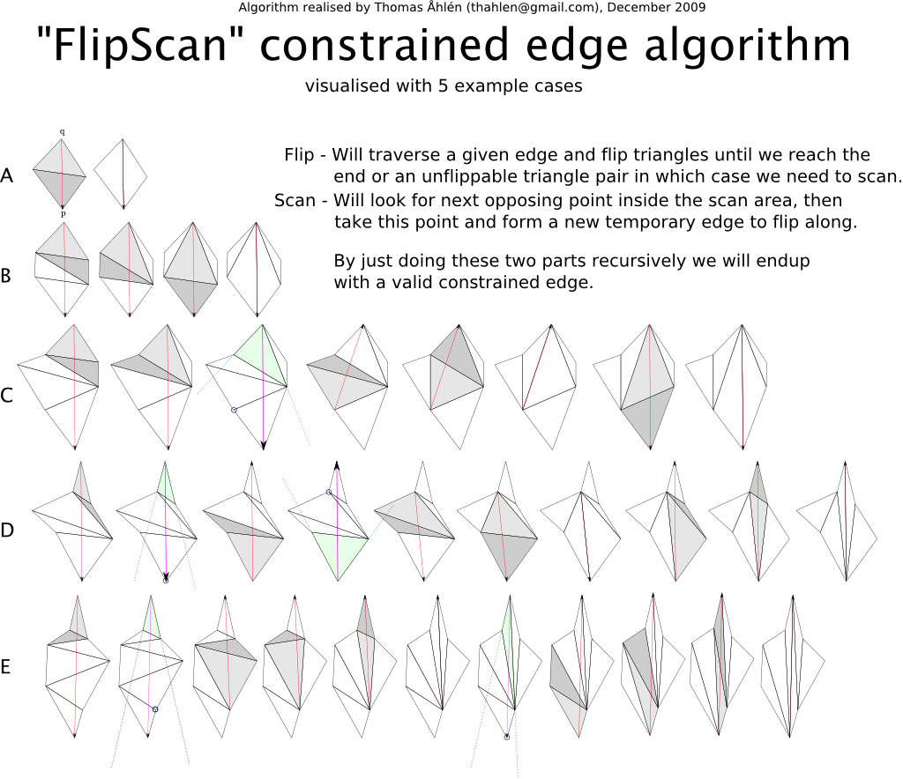

# FlipScan constrained-edge insertion



Diagram by Thomas Åhlén, December 2009.

## Purpose

The sweep creates a Delaunay-ish triangulation while points are inserted from
low Y to high Y. Polygon boundaries and hole boundaries still need to become
real triangle edges. FlipScan is the recovery step that forces one constrained
segment into the current triangulation without rebuilding the mesh.

The input is an existing triangulation and one segment `(ep, eq)`. The output is
the same triangulation with `(ep, eq)` present as a triangle side and marked as
constrained. Later legalization and mesh cleanup must not cross that side.

## Plain algorithm

First, walk through the triangles cut by the constrained segment. At each
triangle, test the two points opposite the current endpoint against the segment
line.

If both tests are on the same side, the segment does not cross the local
opposite edge yet. Move to the next neighbor and keep walking.

If the tests are on different sides, the segment crosses the local edge. Try to
flip that edge. A flip is allowed when the opposite point is inside the scan
area. The scan area is the small wedge in which the edge rotation keeps the walk
valid.

If the pair is flippable, rotate the two triangles. If that rotation creates the
requested constrained edge, mark it and stop. Otherwise, pick the next triangle
on the crossing path and continue flipping.

If the pair is not flippable, scan. The scan chooses the next opposing point on
the side indicated by orientation tests, creates a temporary edge to flip along,
and recurses until a flippable pair is found. After that temporary work, resume
the original constrained-edge walk.

That is FlipScan: flip while the local pair is legal to rotate; scan when it is
not; repeat until the constrained segment exists.

## Engine shape

In the arena engine the path is:

```nim
triangulate(ws):
  initTriangulation(ws)
  createAdvancingFront(ws)
  sweepPoints(ws)
  finalizationPolygon(ws)
```

`sweepPoints` inserts sorted points into the advancing front. Every point owns a
chain of boundary edges that start at that point. After the point is inserted,
the engine recovers each of those edges.

```nim
proc sweepPoints(ws: var ArenaWorkspace) =
  for p in ws.activePoints[1 .. ^1]:
    let n = ws.pointEvent(p)

    var edge = p.firstEdge
    while edge != nil:
      ws.edgeEvent(edge, n)
      edge = edge.next
```

The public `edgeEvent(edge, node)` sets the current constraint, fills small
front cavities beside it, then starts the triangle walk from the new point's
triangle.

```nim
proc edgeEvent(ws: var ArenaWorkspace, edge: Edge, n: Node) =
  ws.edgeEvent.constrainedEdge = edge
  ws.edgeEvent.right = edge.p.x > edge.q.x

  if n.triangle.hasSide(edge.p, edge.q):
    return

  ws.fillEdgeEvent(edge, n)
  ws.walkConstrainedEdge(edge.p, edge.q, n.triangle, edge.q)
```

The walk is local. It only follows triangle neighbors that the segment can cross.
The two orientation tests tell whether the segment crosses the current opposite
edge.

```nim
proc walkConstrainedEdge(
    ws: var ArenaWorkspace,
    ep, eq: Point,
    t: Triangle,
    p: Point,
) =
  while true:
    if t.hasSide(ep, eq):
      t.markConstrainedEdge(ep, eq)
      return

    let p1 = t.pointCCW(p)
    let p2 = t.pointCW(p)
    let o1 = orient2d(eq, p1, ep)
    let o2 = orient2d(eq, p2, ep)

    if o1 == collinear or o2 == collinear:
      splitOrRejectCollinearConstraint(ws, ep, eq, t)
      return

    if o1 != o2:
      ws.flipEdgeEvent(ep, eq, t, p)
      return

    t = if o1 == cw: t.neighborCW(p) else: t.neighborCCW(p)
```

`flipEdgeEvent` is the normal flip path. It looks at the neighbor across the
current edge, finds that neighbor's opposite point, and checks whether the pair
is in the scan area.

```nim
proc flipEdgeEvent(
    ws: var ArenaWorkspace,
    ep, eq: Point,
    t: Triangle,
    p: Point,
) =
  let ot = t.neighborAcross(p)
  let op = ot.oppositePoint(t.sharedEdgeWith(ot))

  if inScanArea(p, t.pointCCW(p), t.pointCW(p), op):
    ws.rotateTrianglePair(t, p, ot, op)
    ws.mapTriangleToNodes(t)
    ws.mapTriangleToNodes(ot)

    if p == eq and op == ep:
      t.markConstrainedEdge(ep, eq)
      ot.markConstrainedEdge(ep, eq)
      discard ws.legalize(t)
      discard ws.legalize(ot)
      return

    let side = orient2d(eq, op, ep)
    let next = ws.nextFlipTriangle(side, t, ot, p, op)
    ws.flipEdgeEvent(ep, eq, next.triangle, next.point)
  else:
    let nextPoint = nextFlipPoint(ep, eq, ot, op)
    ws.flipScanEdgeEvent(ep, eq, t, ot, nextPoint)
    ws.walkConstrainedEdge(ep, eq, t, p)
```

`flipScanEdgeEvent` is the escape hatch. It follows temporary opposing points
until the temporary edge can be flipped. Then control returns to the original
edge event.

```nim
proc flipScanEdgeEvent(
    ws: var ArenaWorkspace,
    ep, eq: Point,
    flipTriangle, t: Triangle,
    p: Point,
) =
  let ot = t.neighborAcross(p)
  let op = ot.oppositePoint(t.sharedEdgeWith(ot))

  if inScanArea(eq, flipTriangle.pointCCW(eq), flipTriangle.pointCW(eq), op):
    ws.flipEdgeEvent(eq, op, ot, op)
  else:
    let nextPoint = nextFlipPoint(ep, eq, ot, op)
    ws.flipScanEdgeEvent(ep, eq, flipTriangle, ot, nextPoint)
```

`nextFlipPoint` is only an orientation choice.

```nim
proc nextFlipPoint(ep, eq: Point, ot: Triangle, op: Point): Point =
  case orient2d(eq, op, ep)
  of cw:
    ot.pointCCW(op)
  of ccw:
    ot.pointCW(op)
  of collinear:
    raise ConstraintError("opposing point on constrained edge")
```

## State repaired after a flip

The engine rotates two arena triangles in place. No triangle object is allocated
for the flip. After the rotation it must repair three kinds of state:

- triangle vertex order and neighbor links
- constrained and Delaunay edge flags carried across the rotation
- advancing-front node pointers for triangles exposed on the front

That is why `flipEdgeEvent` calls `rotateTrianglePairIndexed`,
`mapTriangleToNodes`, and then `legalize`.

`legalize` restores the local Delaunay condition where constrained edges allow
it. Constrained flags stop later legalization and final mesh cleanup from
walking across polygon and hole boundaries.

## Failure cases

The implementation rejects collinear constrained-edge points in the middle of an
edge event. It also raises if the triangle walk or scan needs a missing neighbor.
Those cases mean the input is outside the current engine contract or the mesh
topology has already become invalid.
